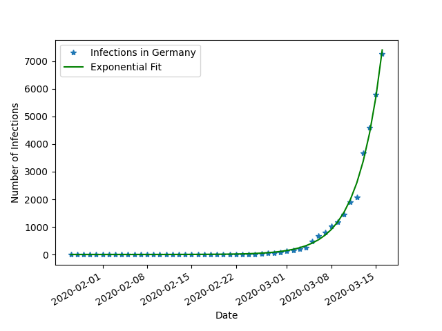
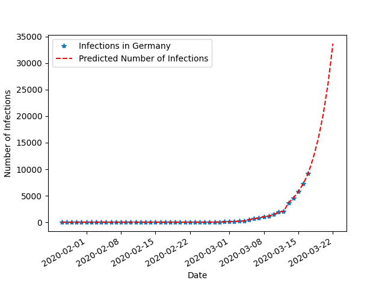

# Live Covid-19 extrapolation of infected persons in Germany

## Current situation on 2020-03-30:

## Extrapolation for 10 days (Basic exponential growth assumed)

## Data source
[Data Repository by Johns Hopkins CSSE](https://github.com/CSSEGISandData/COVID-19)
